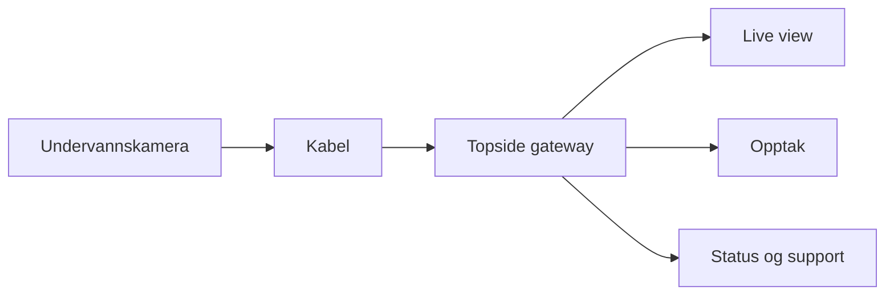

# Arkitektur

## Prinsipp

Hold kameraet under vann så enkelt som mulig. Flytt kompleksitet, serviceverdi og fremtidig abonnementslogikk til gateway og software.

## V0-retning

- Kamera under vann.
- Gateway over vann.
- Ingen full subsea gateway i første versjon.
- Unngå custom PCB tidlig hvis eksisterende moduler kan brukes.
- La første pilot påvirke nøyaktig produktpakke.
